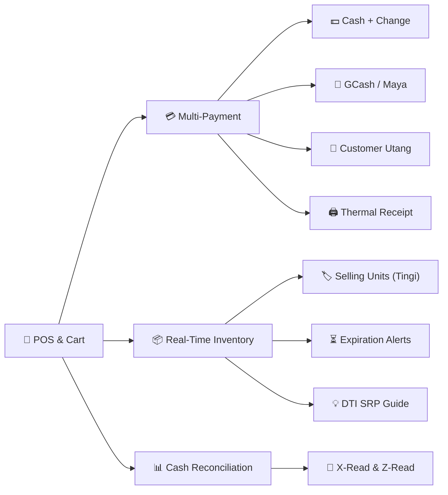

<div align="center">


# 📱 TINDA POS Free for Android

**Fast, 100% offline, sign-language-friendly Point of Sale and Inventory System designed for Philippine sari-sari stores, minimarts, and retail counters on Android phones and tablets.**

### v1.0.37 Stable · Product Photo Upload, Fast Counter Thumbnails & Zero-Bloat Compression

[-3DDC84?style=for-the-badge&logo=android&logoColor=white)](https://github.com/Yazerukun/TINDA-POS-Android-Free/releases/latest)
[](https://github.com/Yazerukun/TINDA-POS-Android-Free/releases/tag/v1.0.37)
[-F59E0B?style=for-the-badge&logo=sqlite&logoColor=white)](#-data-privacy--offline-first)
[](#-automated-testing)
[](#-license)

<br/>

[📥 **Download Release APK (v1.0.37)**](https://github.com/Yazerukun/TINDA-POS-Android-Free/releases/download/v1.0.37/TindaPOS-Free-1.0.37.apk) &nbsp;•&nbsp; 
[📖 **User Manual**](release-docs/USERMANUAL.md) &nbsp;•&nbsp; 
[🚀 **Release Notes**](https://github.com/Yazerukun/TINDA-POS-Android-Free/releases/tag/v1.0.37) &nbsp;•&nbsp; 
[🐛 **Report an Issue**](https://github.com/Yazerukun/TINDA-POS-Android-Free/issues)

---

</div>

## 🏪 The Complete Retail Counter in Your Pocket

**TINDA POS Free for Android** empowers neighborhood retailers, sari-sari stores, canteens, and micro-merchants with an enterprise-grade POS counter directly on standard Android smartphones and tablets. 

Built from the ground up to handle high-frequency everyday retail: scan barcodes with your device camera, ring up multi-unit retail sales (*tingi*, pieces, packs, cases), manage customer store credit (*utang*), print receipts over Bluetooth, track shelf life, and balance cash drawers with zero cloud dependencies.

> [!TIP]
> **100% True Offline Operation:** Your store database stays permanently on your device in persistent local storage. There are no monthly subscriptions, no sign-ups, no remote server lockouts, and no requirement for an active internet connection or mobile data.

---

## ⚡ What's New in v1.0.37

| Feature / Improvement | What It Delivers at the Counter |
| :--- | :--- |
| 📸 **Product Photo Upload & Camera Capture** | Attach photos to products directly using the phone's camera or photo gallery in the Add/Edit Product modal. Includes live preview, change, and remove actions. |
| ⚡ **Offline Canvas Auto-Compressor** | High-resolution photos are automatically resized to max 320×320px (~15–30KB) on device before saving. Prevents app lag, avoids database bloat, and guarantees rapid POS grid rendering. |
| 🖼️ **Visual POS & Inventory Grid Thumbnails** | Product cards on the POS grid and inventory tables now display crisp product photos for instantaneous counter recognition by cashiers. |
| 💾 **100% Universal Backup Compatibility** | Stored directly within the Dexie offline database, meaning all product photos are seamlessly backed up and restored via `.tinda-backup`. |
| 🔄 **Per-Piece Partial Refund** | Refine quantities to refund per transaction item using an interactive stepper `[−] [qty] [+]`. |
| 🏷️ **PWD & Senior Citizen Auto-Discount (20%)** | 1-tap statutory 20% discount calculation with dynamic cart total recalculation. |
| 🗂️ **Nested Subcategories & Live Refresh** | 2-level category tree with real-time reactive modal updates without restarting the app. |

---

## 📥 Download & Installation

Download the official signed release package directly to your Android phone or tablet:

| Package Asset | Size | Checksum / Integrity | Target Devices |
| :--- | :---: | :--- | :--- |
| [**`TindaPOS-Free-1.0.37.apk`**](https://github.com/Yazerukun/TINDA-POS-Android-Free/releases/download/v1.0.37/TindaPOS-Free-1.0.37.apk) | **6.66 MB** | `0D5AD9338EE15B89B332AF49DE9B90BBB0E7806CBA8938E7483CBB6A99A1D570` | Android 7.0 (Nougat) to Android 15+ |
| [**`SHA256SUMS-v1.0.37.txt`**](https://github.com/Yazerukun/TINDA-POS-Android-Free/releases/download/v1.0.37/SHA256SUMS-v1.0.37.txt) | 92 B | Official SHA-256 hash manifest | Checksum verification |

> [!NOTE]
> **Upgrading from Earlier Versions:** Installing `TindaPOS-Free-1.0.37.apk` over any previous version (v1.0.27 through v1.0.36) **fully preserves your sales history, inventory, customer ledger, and settings**. All official builds are cryptographically signed with the official persistent keystore.

### System Requirements
- **Operating System:** Android 7.0 (API level 24) or higher.
- **Memory (RAM):** 2 GB minimum (optimized for smooth performance on entry-level hardware).
- **Disk Storage:** ~25 MB free space.
- **Peripherals (Optional):** Bluetooth for 58mm/80mm thermal ESC/POS receipt printers; camera for barcode scanning.

---

## 🚀 Key Modules & Capabilities



### 1. 🛒 High-Speed Point of Sale (POS)
- **Fluid Touch Grid:** Instant search by product name, SKU, or category pill filter with optical typography and tactile spring responses.
- **Built-in Camera Barcode Scanner:** Scan UPC, EAN, or custom barcodes directly with your phone's camera.
- **Selling Units (Tingi / Multi-Unit Retail):** Sell items individually, in packs, or by wholesale cases with automatic stock conversion (e.g., 1 Box = 24 Pieces).
- **Hold & Resume Carts:** Hold a customer's cart while they pick up another item, ring up another customer, and resume with one tap.
- **Itemized & Cart Discounts:** Quick-select PWD & Senior 20% discounts or custom fixed-peso discounts with live recalculation.

### 2. 🤝 Customer Utang & Store Credit Ledger
- **Inline POS Charging:** Select a customer directly on checkout to charge store credit.
- **Customer Directory:** Track customer phone numbers, addresses, personal credit limits, and total outstanding balances.
- **Credit Limit Safeguards:** Immediate warnings if an order exceeds the customer's credit limit.
- **Fast Settlements:** Accept partial or full cash payments against outstanding balances with automatic shift register cash-in logging.
- **1-Tap Share Reminders:** Share statement reminders directly to SMS, Messenger, WhatsApp, or Viber.

### 3. 📦 Inventory & Shelf-Life Management
- **Hierarchical Categories:** Main categories and subcategories with intuitive management and drilldown.
- **Per-Item Expiration:** Track expiration dates on perishable items. Products without expiration dates remain 100% sellable with zero blockers.
- **Low Stock Warnings:** Visual alerts when inventory drops below your customizable threshold.
- **Fast Restock & Withdrawal:** Add new stock with supplier purchase cost tracking or record damaged/expired withdrawals.
- **CSV Bulk Import & Export:** Populate your entire store catalog in minutes using standard Excel/CSV templates.

### 4. 🟢 TINDA BANTAY (172 Commodity Market Price Catalog)
- **Official DTI SRP Guide:** 172 pre-bundled Philippine commodities (canned goods, milk, coffee, noodles, condiments, toiletries).
- **1-Tap "Adopt Price":** Compare supplier costs against prevailing Suggested Retail Prices and apply recommended selling prices with one touch.
- **100% Offline Seed:** Ready out-of-the-box on brand-new devices without downloading extra data.

### 5. 🖨️ Thermal Receipt Printing (ESC/POS)
- **Bluetooth Pairing:** Seamless connection with standard 58mm and 80mm wireless thermal receipt printers.
- **Auto-Print on Sale:** Prints customer receipts automatically upon completing checkout.
- **Digital Sharing:** Share receipts directly to messaging apps or social platforms when a printer is not present.

### 6. 💰 Cash Reconciliation & Daily Audits
- **Denomination Cash Count:** Input exact counts of Philippine bills (₱1,000, ₱500, ₱200, ₱100, ₱50, ₱20) and coins before shift closing.
- **Shift Reports:** Generate instant **X-Read** (interim mid-day report) and **Z-Read** (final shift closing) with drawer over/short computations.

---

## 🖨️ Bluetooth Thermal Printer Setup (1-Minute Guide)

1. **Pair Printer with Android:**
   - Power on your 58mm or 80mm Bluetooth thermal printer.
   - Open Android **Settings → Bluetooth** and pair with the device (default PIN: `0000` or `1234`).
2. **Connect in TINDA POS:**
   - In the app, open **More → Settings → Printer**.
   - Select your printer from the detected devices list and choose paper width (**58mm** or **80mm**).
3. **Verify Alignment:**
   - Tap **Test Print** to verify paper feed, alignment, and formatting.
   - Toggle **Auto-print after sale** for instant receipt generation upon checkout.

---

## 🔒 Data Privacy & Offline First

- **Zero Cloud Storage:** All store data, sales history, customer credit records, and inventory remain strictly on your local device.
- **IndexedDB Engine:** High-performance local storage powered by [Dexie.js](https://dexie.com/) with automated transactional safety.
- **Universal `.tinda-backup`:** Export a complete backup file to Google Drive, an SD card, or USB flash drive. Backups are 100% cross-compatible with the Windows desktop version of TINDA POS.

---

## 🛠️ Architecture & Tech Stack

```text
┌─────────────────────────────────────────────────────────────┐
│                    TINDA POS Mobile Shell                   │
├──────────────────────────────┬──────────────────────────────┤
│  Frontend (React + Vite)     │  Native Bridge (Capacitor)   │
│  • React 19 + TypeScript     │  • Bluetooth Serial ESC/POS  │
│  • Tailwind CSS Dark Theme   │  • Camera Barcode Scanner    │
│  • Lucide React Icons        │  • Native In-App APK Updater │
│  • Zustand State Stores      │  • File System Storage       │
├──────────────────────────────┴──────────────────────────────┤
│                    Data Storage Layer                       │
│  • Dexie.js (IndexedDB Local Database v4)                   │
│  • Bidirectional .tinda-backup Exchange (Android <-> PC)   │
└─────────────────────────────────────────────────────────────┘
```

---

## 🧪 Automated Testing

TINDA POS Free maintains rigorous test coverage to prevent counter regressions and safeguard merchant data:

```bash
npm test
```

```text
Test Files  18 passed (18)
     Tests  109 passed (109)
  Duration  ~20s
```

Suites cover cash counts, hold-and-resume cart flows, price reference matching, partial refund calculations, PWD/Senior discounts, customer utang tracking, product form payloads, subcategories, and Dexie database migrations.

---

## 💻 Building from Source

### Prerequisites
- **Node.js**: v20+
- **Java Development Kit (JDK)**: OpenJDK 21
- **Android SDK**: API level 34+ (Build Tools 35.0.0+)
- **Gradle**: 8.14+

### Build Steps

```bash
# 1. Clone repository
git clone https://github.com/Yazerukun/TINDA-POS-Android-Free.git
cd TINDA-POS-Android-Free

# 2. Install dependencies
npm install

# 3. Run test suite
npm test

# 4. Build web production bundle
npm run build

# 5. Sync bundle into Android native shell
npx cap sync android

# 6. Compile release APK (PowerShell / Windows)
$env:JAVA_HOME = "D:\DevTools\jdk-21"
$env:ANDROID_HOME = "D:\DevTools\android-sdk"
cd android
.\gradlew.bat assembleRelease
```

The signed release APK will be generated at:
`android/app/build/outputs/apk/release/app-release.apk`

---

## 📄 License

Proprietary. **Free to use for personal and small retail businesses in the Philippines.** Redistribution, commercial re-packaging, or charging subscription fees for this software is strictly prohibited.

---

<div align="center">

**Crafted with care for Filipino Retailers and Sari-Sari Store Owners.**

[](https://github.com/Yazerukun/TINDA-POS-Android-Free)

</div>
