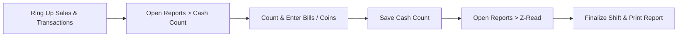

<div align="center">


# 📱 TINDA POS Free for Android

**Free, 100% offline point-of-sale and inventory system for Philippine sari-sari stores, minimarts, and small businesses on Android phones and tablets.**

### v1.0.43 Stable · Clean Modern White Edition & Desktop Feature Parity

[-3DDC84?style=for-the-badge&logo=android&logoColor=white)](https://github.com/Yazerukun/TINDA-POS-Android-Free/releases/latest)
[](https://github.com/Yazerukun/TINDA-POS-Android-Free/releases/tag/v1.0.43)
[-F59E0B?style=for-the-badge&logo=sqlite&logoColor=white)](#your-data-and-privacy)
[](#development)
[](#license)

<br/>

[📥 **Download Release APK (v1.0.43)**](https://github.com/Yazerukun/TINDA-POS-Android-Free/releases/download/v1.0.43/TindaPOS-Free-1.0.43.apk) &nbsp;•&nbsp; 
[📖 **User Manual**](release-docs/USERMANUAL.md) &nbsp;•&nbsp; 
[🚀 **Release Notes**](https://github.com/Yazerukun/TINDA-POS-Android-Free/releases/tag/v1.0.43) &nbsp;•&nbsp; 
[🐛 **Report an Issue**](https://github.com/Yazerukun/TINDA-POS-Android-Free/issues)

---

</div>

## 🏪 Your Counter in Your Pocket

**TINDA POS Android Free** brings the complete, trusted TINDA POS retail workflow to Android mobile phones and tablets. Record everyday transactions, manage inventory, track customer credit (*utang*), connect direct Bluetooth receipt printers, and reconcile cash drawer shifts without needing an active internet connection.

Your store database stays 100% offline on your device — no cloud accounts, no subscription fees, no locked features, and no remote dependencies.

---

## ⚡ What's New in v1.0.43 (Desktop Parity & Clean White Edition)

| Feature / Improvement | What it means at the counter |
| :--- | :--- |
| ☀️ **Modern Clean White Theme** | High-contrast, sunlight-readable white and slate interface designed specifically for busy store environments with 48px ergonomic touch targets. |
| 🎨 **Sharp Brand Identity & Icons** | Ultra-crisp vector-sharp app logo and launcher icons across all Android display densities (mdpi to xxxhdpi). |
| 💵 **Petty Cash / Cash Movements** | Dedicated drawer tracking for Cash In (*Dugang Sukli*) and Cash Out (*Pang-gasto / Withdraw*) with full shift audit reconciliation. |
| 🏷️ **Wholesale Pricing Tiering** | Set Wholesale Price and Min Qty thresholds. POS cart automatically drops unit price to wholesale rate when quantity is reached. |
| 📱 **Dynamic GCash & Maya QR Modal** | Clean phone-to-phone QR code checkout with exact transaction total and 1-tap "Copy Amount" for zero cashier mistakes. |
| ⚠️ **Product Expiration & Alerts** | Track per-item shelf life with real-time Expired and Near-Expiry badges plus a dedicated "Expiring" inventory filter. |
| 📋 **Itemized Utang Ledger** | Expandable credit ledger showing full item breakdown, 1-tap Bluetooth charge slip printing, and SMS/Messenger reminder sharing. |
| 🛡️ **Zero Data Loss Dexie v4 Migration** | Seamless additive schema migration preserving all historical transactions, products, customer records, and credits. |
| 🧪 **102/102 Automated Vitest Tests** | 100% pass across all 15 test suites guaranteeing rock-solid stability and zero regressions. |

---

## 📥 Download & Installation

Get the official release package from the [Releases page](https://github.com/Yazerukun/TINDA-POS-Android-Free/releases/latest):

| File | Size | SHA-256 Checksum | Purpose |
| :--- | :--- | :--- | :--- |
| [**`TindaPOS-Free-1.0.43.apk`**](https://github.com/Yazerukun/TINDA-POS-Android-Free/releases/download/v1.0.43/TindaPOS-Free-1.0.43.apk) | 5.9 MB | `0d43807ca485fee9631c5a26719aadc8ceb9d0f374aea3eec5c169b6a9be632d` | **Recommended**. Official signed release APK for Android phones and tablets. |

> [!NOTE]
> **Data Preservation on Upgrades:** Installing a newer APK over an existing version **preserves all your store records, sales, inventory, and settings**. All official releases are signed with the same persistent key (`CN=TINDA POS Free`).

### System Requirements
- **OS:** Android 7.0 (Nougat, API 24) or higher (tested up to Android 14+).
- **RAM:** Minimum 2 GB (runs smoothly even on budget devices).
- **Storage:** ~20 MB free space.
- **Hardware:** Optional Bluetooth for thermal receipt printers, optional camera for barcode scanning.

---

## 🔄 In-App Software Updates

TINDA POS Android Free updates itself directly from official GitHub releases — no Google Play Store required:

1. **Automatic Check:** Once every 24 hours on launch, the app checks for new stable updates. You can also check manually at **More → Settings → About → Software Update → Check for Updates**.
2. **One-Tap Download:** When an update is detected, tap **Download Update**. A native progress bar tracks download progress.
3. **Seamless Installation:** The app launches Android's native package installer with your data fully preserved.

---

## 🛠️ Everyday Tools & Features

| Module | Features Included |
| --- | --- |
| **POS & Checkout** | Fast product search, category chip pills, barcode scanner, quantity adjustments, Hold & Resume carts, and itemized discounts. |
| **Payments** | Cash with fast denomination buttons & change computation, GCash reference logging, Maya reference logging, Split Payments, and Customer Utang (Credit). |
| **Utang Tracking** | Customer ledger, balance tracking, credit limits, payment history, and partial settlements. |
| **Inventory & Expiry** | Low-stock indicators, product batch numbers, expiry alerts, receiving logs, CSV product import/export, and stock movements. |
| **Shift Reconciliation** | Cash Count denomination breakdown (bills & coins), required cash count before Z-Read, and drawer over/short computation. |
| **Shift Reports** | **X-Read** (interim shift report) and **Z-Read** (final shift closing) with full audit summary and reprint capabilities. |
| **Thermal Printing** | Auto-print on checkout, receipt reprints, 58mm/80mm thermal width support, and digital share sheet. |
| **Data Management** | 100% offline IndexedDB persistence, manual JSON database backups, and validated backup restore. |

---

## 🖨️ Thermal Printer Setup Guide

Printing receipts with your mobile phone or tablet takes less than a minute:

1. **Pair Your Printer:**
   - Turn on your 58mm or 80mm Bluetooth thermal printer.
   - Go to your Android device's Bluetooth settings (or open **TINDA POS → More → Settings → Printer → Pair Bluetooth**).
   - Pair with your printer (default PIN is usually `0000` or `1234`).
2. **Select Printer in App:**
   - In **Settings → Printer**, tap your paired thermal printer.
   - Choose your paper width (**58mm** or **80mm**).
   - Tap **Test Print** to verify alignment.
3. **Ready to Sell:**
   - Enable **Auto-print after sale** to automatically print customer receipts upon completing checkout.

---

## 💰 Cash Reconciliation Protocol: Cash Count First, Then Z-Read

To ensure exact cash drawer balance at the end of each shift:


```mermaid
flowchart LR
    A["Ring Up Sales & Transactions"] --> B["Open Reports > Cash Count"]
    B --> C["Count & Enter Bills / Coins"]
    C --> D["Save Cash Count"]
    D --> E["Open Reports > Z-Read"]
    E --> F["Finalize Shift & Print Report"]
```

1. Finish all pending sales and expenses for the shift.
2. Open **Reports → Cash Count** while your shift is open.
3. Count your cash drawer and input the quantity of each bill and coin denomination.
4. Tap **Save Cash Count**.
5. Open **Reports → Z-Read**, review the verified cash vs. expected cash figures, and close the shift.

---

## 🔒 Your Data and Privacy

- **100% Local Storage:** All store records, transactions, customer utang, and settings are stored locally in the device's persistent IndexedDB storage using [Dexie.js](https://dexie.com/).
- **Zero Telemetry / Zero Cloud:** No personal or commercial data is ever transmitted to external servers.
- **Backups:** Create regular backups under **More → Settings → Backup / Restore**. You can export a universal `.tinda-backup` file and store it on an SD card or cloud drive — it can also be restored on the Windows app, and vice-versa.

---

## 💻 Development & Building from Source

The Android Free app is built with **React 18**, **TypeScript**, **Tailwind CSS**, **Capacitor**, and **Dexie.js**.

### Prerequisites
- Node.js 20+
- JDK 21 (Temurin recommended)
- Android SDK 36 (Build Tools 36.0.0, Platform API 36)
- Gradle 8.14.3

### Build Steps

```bash
# 1. Install dependencies
npm install

# 2. Run test suite (93 unit & integration tests)
npm test

# 3. Build web bundle
npm run build

# 4. Sync web bundle into native Capacitor Android shell
npx cap sync android

# 5. Build signed release APK
source toolchain/env.sh
cd android && ./gradlew assembleRelease
```

The compiled release APK will be located at:
`android/app/build/outputs/apk/release/app-release.apk`

---

## 📄 License

Proprietary. **Free to use for personal and small business purposes in the Philippines.** Redistribution, resale, or packaging into paid commercial services without explicit permission is strictly prohibited.
